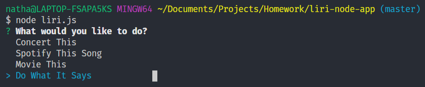
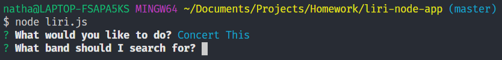

# **LIRI**
 LIRI is a Language Interpretation and Recognition Interface that you can ask anything from!!\
 Well almost anything ... kind of anything ... just four things for now.

 ## **Choosing an action**
 ---
 You can ask LIRI to:
 - Search This  
 - Spotify This Song  
 - Movie This  
 - Do What It Says  
    
 Liri contains an in-terminal menu that allows you to pick which ever option you want.\
### **Search This**
Search This will allow you to find all upcoming events for any band. Bands in Town API is being used for this action.
### **Spotify This Song**
Spotify This Song will search the Spotify API for whatever song you provide.
### **Movie This**
Movie This uses the OMDB API to find and display information on any movie that you input.
### **Do What It Says**
Do What It Says will read from the random.txt using File System. Using the action and option read, LIRI will perform the appropriate action.

## **Choosing a target**
---
If the user does not choose Do What It Says, they will be prompted to enter a search term in conjunction with the action chosen.

| **Action**         | **Option**  |
| ------------------ | ----------- |
| Search This        | Band        |
| Spotify This Song  | Song        |
| Movie This         | Movie       |

## **Enjoy life**
---
LIRI will now provide you with the information you need to live a super duper happy life!